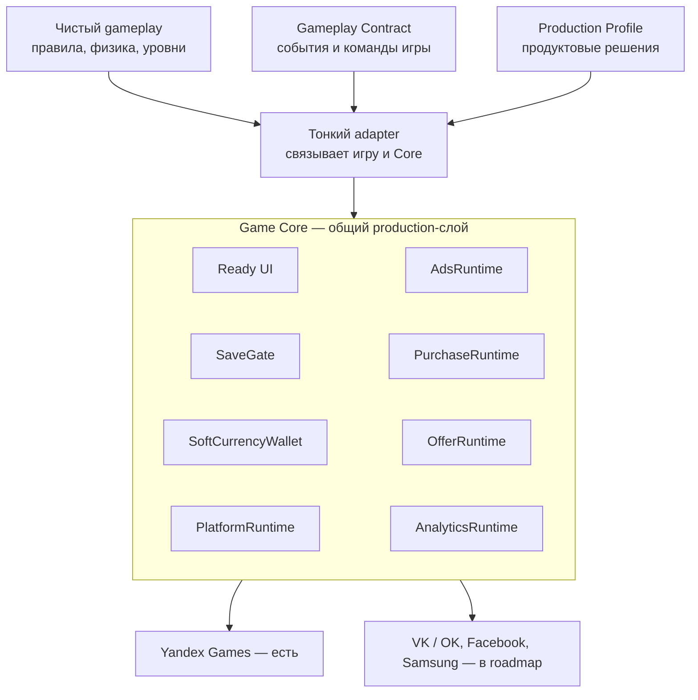
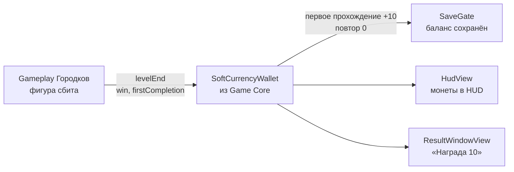

# Game Core

Game Core — production SDK для HTML5/web-игр.

Главная идея: **игровая механика остаётся внутри конкретной игры, а повторяющийся production-слой даёт Game Core** —
интерфейс, сохранения, soft currency, реклама, покупки, офферы, аналитика и интеграция с платформой.

- **Runtime/API baseline:** `d773319` — ветка `feat/production-profile-v1`, версия пакета `0.2.0`.
- **Статус:** рабочая feature-ветка: не merged в `main`, stable release tag пока нет.
- **Проверки Core:** 724/724 automated tests, `tsc`, build, `smoke:platform`, `smoke:platform-yandex` — PASS.
- **Реальные игры:** SoliPix (DOM/CSS) и Городки (Three.js + Rapier), Core changes during integration = 0.

Игра подключает Core по точному commit или tag, без «latest».

## Как это работает



- **Gameplay Contract** — общий словарь между игрой и Core: события `ready / levelStart / levelEnd`,
  команды `startLevel / restart / setPaused / setSound`, прогресс уровней.
- **Production Profile** (`GameProductionProfile`) — продуктовые решения игры: нужна ли валюта и кто ей владеет,
  награды, реклама, покупки, платформа, ключи сохранений. Проверяется `validateGameProductionProfile`.
- **Adapter** — небольшой host-код конкретной игры: переводит её события в Contract и включает нужные части Core.

Сейчас adapter каждой игры сам собирает нужные компоненты Core. Автоматическая сборка production-слоя из одного
Profile (Production Composer / Bootstrap) — цель следующего этапа, её пока нет.

### Кто за что отвечает

| Игра (gameplay) | Game Core (generic production infrastructure) |
|---|---|
| игровые правила | Ready UI: HUD, карта уровней, окна |
| физика и механика | инфраструктура сохранений (`SaveGate`) |
| логика уровней | soft currency, если ей владеет Core (`SoftCurrencyWallet`) |
| scoring | показ результата уровня (`ResultWindowView`) |
| game-specific визуал | реклама: решает, можно ли показать (`AdsRuntime`) |
| game-specific метрики | покупки и NoAds (`PurchaseRuntime`) |
| | офферы (`OfferRuntime`), аналитика (`AnalyticsRuntime`) |
| | интеграция с платформой (`PlatformRuntime`, Yandex) |

Core не содержит игровых правил: например, `SoftCurrencyWallet` не читает метрики игры, а размер награды
за уровень задаёт Profile игры.

### Точки входа пакета

- `game-core` — runtimes без рендеринга (renderer-agnostic).
- `game-core/pixi` — Ready UI на PixiJS 8. Для игр не на Pixi (DOM, Three.js) есть прозрачный
  overlay `createReadyUiOverlay`: UI Core рисуется поверх игры, а её собственный ввод продолжает работать.
- `game-core/platform/yandex` — адаптер Yandex Games, отдельный bundle (в `game-core` SDK платформы не попадает).

## Что Game Core уже умеет

| Группа | Состав | Где подтверждено в реальной игре |
|---|---|---|
| Foundation | `CoreRuntime`, `UiRuntime`, `MotionRuntime`, `FxRuntime` | первые три — SoliPix и Городки; `FxRuntime` в этих двух играх не используется |
| Production-интеграция | Gameplay Contract, `GameProductionProfile`, `SaveGate`, `SoftCurrencyWallet` | Городки |
| Production runtimes | `AdsRuntime` + Ads Policy, `PurchaseRuntime`, `PlatformRuntime` | SoliPix на реальном Yandex draft |
| | `OfferRuntime` | Trail Arrow 0.1.22 (локальная интеграция) |
| | `AnalyticsRuntime` | тесты и showcase; в SoliPix и Городках не подключён |
| Ready UI (`game-core/pixi`) | `HudView`, `LevelMapView`, `SettingsWindowView` | SoliPix и Городки |
| | `ShopWindowView`, `NoAdsWindowView` | SoliPix |
| | `ResultWindowView` | Городки |
| | `LivesWindowView`, `StarterPackWindowView` | тесты и showcase; в SoliPix и Городках не используются |
| | shared primitives: `UiButton`, `ModalWindow`, `ReadyUiOverlay` | SoliPix и Городки |
| Платформы | DEV (`createDevPlatform`), Yandex (`createYandexPlatform`) | Yandex — SoliPix; DEV — Городки и тесты |
| Будущие платформы | CleverApps (VK / OK, Facebook), Samsung | адаптеров пока нет |

## Проверено на реальных играх

Game Core подключён к двум независимым играм с разным стеком. В обоих случаях gameplay не переписывался,
а сам Core не менялся ради игры.

| | SoliPix | Городки |
|---|---|---|
| Gameplay stack | DOM/CSS | Three.js + Rapier |
| Gameplay переписан | нет | нет |
| Core changes during integration | 0 | 0 |
| Версия Core в proof | `fa9105b` (clean integration), `92464ad` (production Yandex-пакет) | `d773319` |
| Платформа | Yandex Games | DEV (Yandex-сборка не делалась) |
| Real iPhone | PASS | PASS |
| Core UI | HUD, карта уровней, Settings, Shop, NoAds | HUD с монетами, выбор фигуры на карте, Settings, Result |
| Save | PASS на реальном Yandex draft | PASS через `SaveGate`, перезагрузка на устройстве |
| Soft currency | своя экономика игры (owner: gameplay) | добавлена Core: `SoftCurrencyWallet` |
| Экран результата | свой экран победы игры (DOM) | Core `ResultWindowView` |
| Real Yandex draft | PASS | пока не проверялся |
| Real ads / payments | PASS | пока не подключались |
| Автономный production ZIP | PASS, 47/47 проверок на распакованном архиве | не делался |

### Два proof дополняют друг друга

**SoliPix доказал production/platform часть Game Core.** На настоящем Yandex Games draft вручную проверены:
запуск Yandex SDK, Core UI, gameplay, реальная реклама, реальные платежи, сохранения. Игра собрана в автономный
ZIP-пакет (Core, Pixi и арт UI внутри архива, без ссылок на рабочую папку), и на распакованном архиве прошли
47/47 автоматических проверок. Gameplay остался на DOM/CSS — его не переписывали на Pixi.

**Городки доказали другой сценарий.** В исходной 3D-игре soft currency не было вообще. Game Core добавил поверх
существующего gameplay: кошелёк, которым владеет Core, баланс, который переживает перезагрузку, монеты в HUD,
награду за первое прохождение и экран результата Core. Механику игры для этого не трогали.

Вместе они показывают две разные вещи: Core работает на настоящей платформе с деньгами и рекламой (SoliPix)
и может добавить production-экономику в игру, где её не было (Городки). Ни один proof по отдельности
не закрывает оба сценария.

<table>
  <tr>
    <td align="center" valign="top" width="25%"></td>
    <td align="center" valign="top" width="25%"></td>
    <td align="center" valign="top" width="25%"></td>
    <td align="center" valign="top" width="25%"></td>
  </tr>
  <tr>
    <td valign="top">Городки: 3D-gameplay без изменений, сверху <code>HudView</code> Core с балансом монет.</td>
    <td valign="top">Городки: победа в <code>ResultWindowView</code> Core, награда 10 монет за первое прохождение.</td>
    <td valign="top">SoliPix: gameplay на DOM/CSS, сверху HUD Core (монеты, звёзды, настройки).</td>
    <td valign="top">SoliPix: карта уровней <code>LevelMapView</code> Core.</td>
  </tr>
</table>

Скриншоты реальные, из автоматических прогонов в Chrome (390×844): Городки — smoke репозитория
`gorodki-core-clean`, SoliPix — проверка распакованного production ZIP с тестовым Yandex SDK.
Сердце «5 MAX» в HUD Городков — известное ограничение: `HudView` пока всегда рисует жизни,
хотя в профиле Городков `ui.lives: false` (см. «Текущие ограничения»).

### Городки: монеты, которых не было в игре

Исходные Городки: soft currency нет. После подключения Game Core:



Это не отдельный кошелёк, написанный специально для Городков: используется generic `SoftCurrencyWallet`
из Game Core. Числа (+10 за первое прохождение, 0 за повтор) — demo-значения из профиля Городков,
а не правила Core.

Ручная проверка на реальном устройстве — PASS:

| Шаг | Монеты |
|---|---|
| новый игрок | 0 |
| первое прохождение уровня | 10 |
| перезагрузка | 10 |
| повтор того же уровня | 10 |
| следующий новый уровень | 20 |
| перезагрузка | 20 |

Что изменилось в игре: механика не менялась; за всю интеграцию правились 2 gameplay-файла
(`game.js`, `backgrounds.js`, +16/−15 строк), из них для кошелька — +3/−3 строки в `game.js`.
В Core для этого не изменено ни одной строки.

Автоматика: быстрая Node-проверка wallet/save flow 10/10 PASS, static scan PASS, синтаксис JS 10/10 PASS.
Полный browser smoke после подключения кошелька **не завершён**: прогон упёрся в timeout
из-за перегруженной машины (SwiftShader). Приёмка — ручная проверка на реальном устройстве.

## Как подключается новая игра

1. **Вход:** чистая папка gameplay, закреплённый commit/tag Game Core, короткий production spec от product owner.
2. AI или разработчик изучает gameplay и находит реальные точки стыка: старт уровня, победа и поражение,
   restart, пауза, звук, сохранения, кто владеет кадром и вводом.
3. Описывает игру в `GameProductionProfile` и пишет тонкий adapter по Gameplay Contract.
4. Подключает уже существующие возможности Core; gameplay меняется минимально, механика не переписывается.
5. Если не хватает generic-возможности Core — останавливается и описывает gap, а не пишет обход под одну игру.
6. Проходит общий acceptance: сохранения, отсутствие двойных начислений, browser proof, скриншоты,
   реальное устройство, реальная платформа, когда это применимо.

Готовый шаблон задачи для AI: [INTEGRATION_PROMPT.md](INTEGRATION_PROMPT.md).

## Текущие ограничения

- Production Profile пока не исполняется автоматически: нет Production Composer / Bootstrap,
  связку компонентов собирает adapter каждой игры.
- Часть оркестрации Ads / Purchase / NoAds всё ещё повторяется в host-коде игр.
- `HudView` всегда рисует жизни; `SettingsWindowView` всегда рисует кнопку музыки.
- `ResultWindowView` не имеет generic-режима поражения: в Городках проигрыш показывает свой DOM-экран игры.
- `LevelMapView` не умеет режим «все уровни открыты».
- Автономная упаковка доказана только на SoliPix и пока не обобщена в общий pipeline.
- Защита от тихого перехода production-сборки в DEV-режим при сбое SDK доказана в SoliPix-пакете,
  но не централизована в Core.
- Production-пакет SoliPix собран на Core `92464ad`; на `d773319` он не пересобирался.
- Городки не проверялись на реальном Yandex; реклама и платежи там не подключались.
- `AnalyticsRuntime` в реальной игре пока не подключён.
- Stable release tag нет; ветка не merged в `main`.
- CleverApps (VK / OK, Facebook) не production-complete: адаптера пока нет.

## Ближайший roadmap

**Сделано:** Gameplay Contract / Production Profile, `SaveGate`, безопасная запись в облако Yandex,
`SoftCurrencyWallet`, proof SoliPix на реальном Yandex, proof Городков с кошельком и Core Result.

**Дальше:**

1. Закрыть capability gaps Ready UI: lives — опционально, music — опционально, generic режимы Result,
   открытая карта уровней там, где это нужно.
2. Production Composer / Bootstrap V1: Production Profile реально собирает нужный production-слой
   из существующих компонентов.
3. Проверка `INTEGRATION_PROMPT.md` за один проход (one-pass proof).
4. Новая холодная интеграция из чистого исходника игры.
5. Обобщить автономную упаковку.
6. Stable release candidate.
7. Платформы: VK / OK → Facebook → Samsung.

## Текущий инженерный объём

| Метрика | Значение |
|---|---|
| Production code (`src/`, TypeScript) | 11 316 строк кода, 82 файла |
| Tests (`tests/`) | 12 950 строк кода, 68 файлов |
| QA / scripts (`scripts/`, showcase) | 2 842 строки кода, 23 файла |
| Документация (`*.md`) | 3 773 непустые строки, 19 файлов |
| Automated tests | 724 в 59 test-файлах, все PASS |
| Основные runtime-компоненты | 11: 9 классов `*Runtime` + `SaveGate` + `SoftCurrencyWallet` |
| Ready UI | 8 views + 3 shared primitives (`UiButton`, `ModalWindow`, `ReadyUiOverlay`) |
| Platform adapters | 2: DEV, Yandex |
| Реальные игры с proof | 2 |
| Proof на реальном Yandex | 1 (SoliPix) |

LOC — только справочная метрика размера SDK, а не показатель качества. Главные доказательства зрелости:
regression tests, чистые интеграции, proof на реальном устройстве и реальной платформе,
и число изменений Core, которое потребовала новая игра (сейчас 0 в обеих).

Как считалось: только файлы в git (`node_modules/`, `dist/` и другой output не попадают). «Строка кода» — строка,
на которой TypeScript parser находит хотя бы один token: комментарии и пустые строки не считаются.
Исключены: арт Ready UI (69 webp и 1 шрифт), скриншоты `docs/images/`, `package-lock.json`,
test data (1 generated JSON, 2 donor TSV), конфиги сборки.

## Подробнее

- [GAME_CORE_CURRENT.md](GAME_CORE_CURRENT.md) — точное текущее инженерное состояние.
- [INTEGRATION_PROMPT.md](INTEGRATION_PROMPT.md) — шаблон задачи для подключения новой игры.
- [docs/ARCHITECTURE.md](docs/ARCHITECTURE.md) — архитектура и правила каждого runtime (на английском).
- [docs/PIXI_READY_UI.md](docs/PIXI_READY_UI.md) — Ready UI: компоненты, overlay, showcase (на английском).
- [AGENTS.md](AGENTS.md) — обязательные правила для AI-агентов, которые меняют код Core (на английском).
- [docs/superpowers/specs/](docs/superpowers/specs/) — design specs отдельных runtime (на английском).

Основные команды:

```bash
npm test                        # 724 automated tests (Vitest)
npm run build                   # сборка трёх entries + проверка границ bundle
npm run smoke:platform          # DEV-платформа end to end
npm run smoke:platform-yandex   # Yandex adapter на fake SDK
npm run showcase                # Ready UI без игры (Vite)
```
