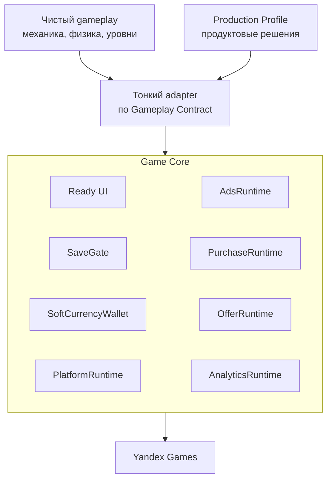
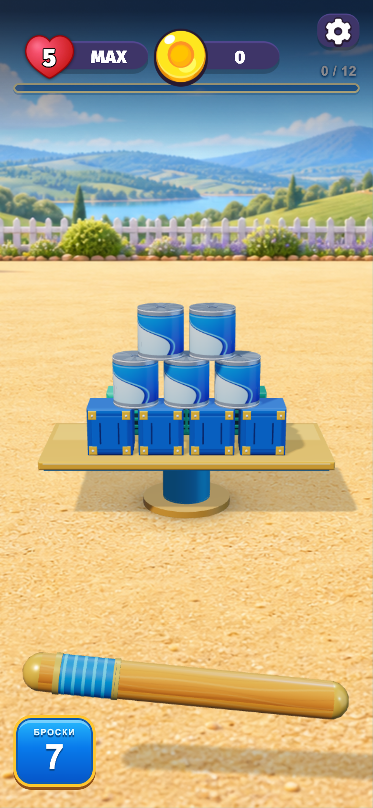
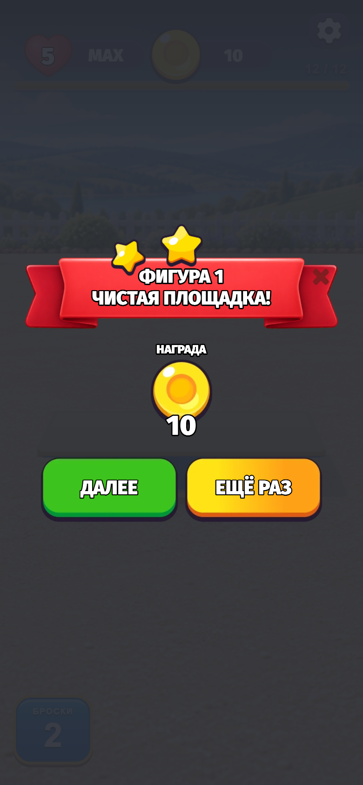
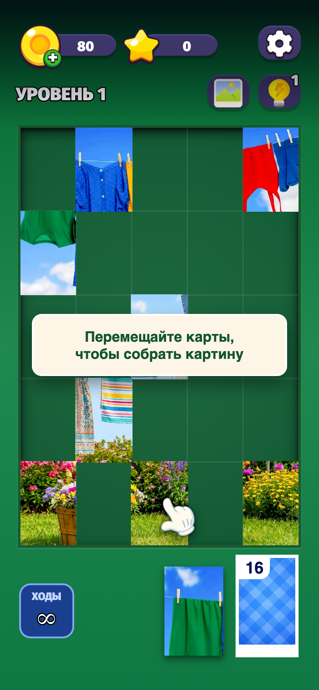
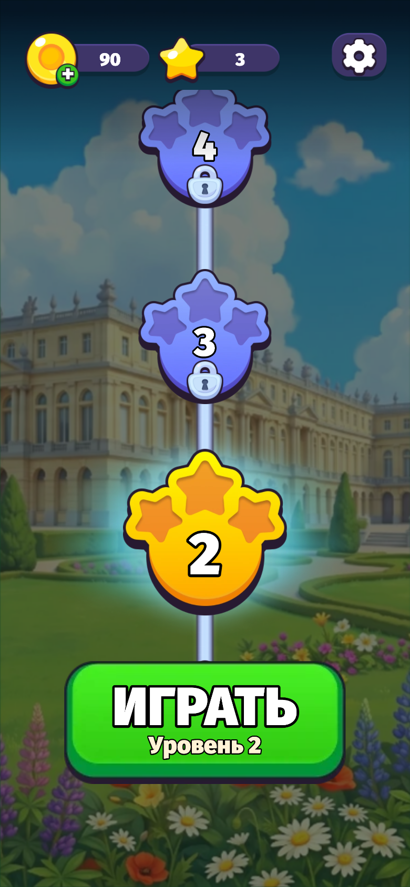

# Game Core

Game Core — production SDK для HTML5/web-игр.

Игровая механика остаётся внутри конкретной игры. Game Core даёт повторно используемый production-слой:
UI, сохранения, soft currency, рекламу, покупки, NoAds, офферы, аналитику и интеграцию с платформами.

- **Runtime/API baseline:** `d773319`
- **Автотесты Core:** 724/724 PASS
- **Реальные игры:** SoliPix (DOM/CSS) и Городки (Three.js + Rapier), изменений Core при интеграции — 0

## Как это работает

- **Gameplay Contract** — общий язык игры и Core: события `ready / levelStart / levelEnd`,
  команды `startLevel / restart / setPaused / setSound`.
- **Production Profile** (`GameProductionProfile`) — продуктовые решения игры: валюта и награды,
  реклама, покупки, платформа, сохранения.
- **Adapter** — небольшой host-код игры: переводит её события в Contract и подключает нужные части Core.

Сейчас нужные части Core подключает adapter каждой игры; автоматическая сборка по Profile — следующий этап.

## Что уже есть в Game Core

| Слой | Что входит |
|---|---|
| Production | Gameplay Contract, `GameProductionProfile`, `SaveGate`, `SoftCurrencyWallet`, `AdsRuntime` + Ads Policy, `PurchaseRuntime`, `OfferRuntime`, `AnalyticsRuntime`, `PlatformRuntime` |
| Ready UI (PixiJS 8) | HUD, карта уровней, окна Settings, Result, Shop, NoAds, Lives, StarterPack; для игр не на Pixi — прозрачный overlay поверх игры |
| Foundation | `CoreRuntime`, `UiRuntime`, `MotionRuntime`, `FxRuntime` |
| Платформы | DEV, Yandex Games |

## Проверено на реальных играх

Две независимые игры с разным стеком:

| | SoliPix | Городки |
|---|---|---|
| Gameplay | DOM/CSS | Three.js + Rapier |
| Gameplay переписан | нет | нет |
| Изменения Core при интеграции | **0** | **0** |
| Реальный iPhone | PASS | PASS |
| Core UI | PASS | PASS |
| Сохранения | PASS | PASS |
| Soft currency | существующая экономика игры | добавлена через `SoftCurrencyWallet` |
| Экран результата | свой DOM-экран игры | `ResultWindowView` Core |
| Реальный Yandex Games draft | PASS | — |
| Реальные реклама и платежи | PASS | — |

**SoliPix доказал production/platform слой.** На реальном Yandex Games draft работают Core UI, gameplay,
реальная реклама, реальные платежи и сохранения. Игра собрана в автономный production ZIP:
на распакованном архиве — 47/47 автоматических проверок. Gameplay остался на DOM/CSS.

**Городки доказали, что Core может добавить экономику, которой в игре не было.** В исходных Городках soft currency
не было вообще. Game Core добавил `SoftCurrencyWallet`, сохранение баланса через `SaveGate`, монеты в HUD,
награду за первое прохождение и `ResultWindowView`. Ручная проверка на реальном устройстве — PASS:

`0` → победа: `10` → перезагрузка: `10` → повтор уровня: `10` → новый уровень: `20` → перезагрузка: `20`

Размер награды задаёт профиль Городков, а не Core. Изменений Core — 0.

<table>
  <tr>
    <td align="center" valign="top" width="25%"></td>
    <td align="center" valign="top" width="25%"></td>
    <td align="center" valign="top" width="25%"></td>
    <td align="center" valign="top" width="25%"></td>
  </tr>
  <tr>
    <td valign="top">Городки: 3D-gameplay и HUD Core с монетами.</td>
    <td valign="top">Городки: <code>ResultWindowView</code> с наградой.</td>
    <td valign="top">SoliPix: DOM-gameplay и HUD Core.</td>
    <td valign="top">SoliPix: карта уровней Core.</td>
  </tr>
</table>

Скриншоты — из автоматических прогонов в Chrome; SoliPix — на распакованном production ZIP с тестовым Yandex SDK.

## Как подключается новая игра

**Вход:** чистый gameplay, закреплённая версия Game Core (commit или tag), короткий production spec.

**AI:**

1. изучает gameplay;
2. находит точки стыка: старт и конец уровня, перезапуск, пауза, звук, сохранения;
3. создаёт `GameProductionProfile`;
4. пишет тонкий adapter по Gameplay Contract;
5. подключает существующие возможности Core, а если generic-возможности не хватает — останавливается
   и описывает, чего не хватает;
6. не переписывает механику.

**Product owner задаёт:** валюту и награды, рекламу и NoAds, product IDs покупок, прогрессию уровней, платформу.

Готовый шаблон задачи для AI — **[INTEGRATION_PROMPT.md](INTEGRATION_PROMPT.md)**.

## Текущий инженерный объём

| Метрика | Значение |
|---|---|
| Production-код (`src/`) | 11 316 LOC |
| Тесты (`tests/`) | 12 950 LOC |
| QA и скрипты | 2 842 LOC |
| Автотесты | 724 PASS |
| Runtime-компоненты | 11 |
| Ready UI | 8 views + 3 primitives |
| Платформы | DEV, Yandex |
| Реальные игры с proof | 2 |
| Proof на реальном Yandex | 1 |

LOC — справочная метрика размера SDK. Главные показатели — тесты, реальные интеграции, proof на реальных
устройствах и платформе и число изменений Core, которое потребовала новая игра.

## Следующий этап

Следующий ключевой этап — **Production Composer / Bootstrap V1**. Он должен по `GameProductionProfile`
автоматически собирать нужный production-слой игры из уже существующих возможностей Core — вместо сборки
вручную в adapter каждой игры.

Цель после этого:

**чистый gameplay + короткий production spec → интеграция AI за один проход → production-сборка**

Остальной roadmap (платформы, stable release) — в [GAME_CORE_CURRENT.md](GAME_CORE_CURRENT.md).

## Подробнее

- [INTEGRATION_PROMPT.md](INTEGRATION_PROMPT.md) — шаблон подключения новой игры.
- [GAME_CORE_CURRENT.md](GAME_CORE_CURRENT.md) — текущее инженерное состояние, ограничения и roadmap.
- [docs/ARCHITECTURE.md](docs/ARCHITECTURE.md) — архитектура runtime (на английском).
- [docs/PIXI_READY_UI.md](docs/PIXI_READY_UI.md) — Ready UI (на английском).
